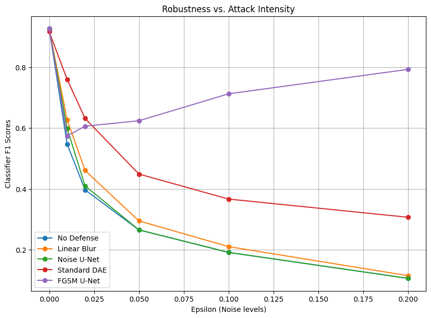
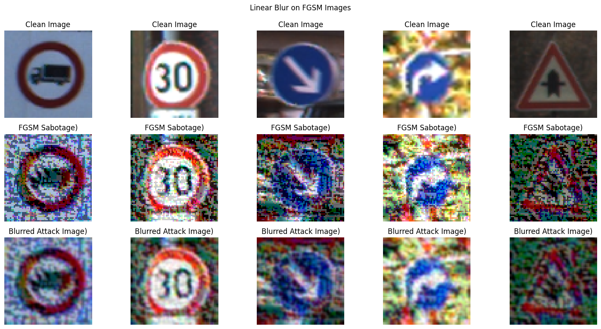
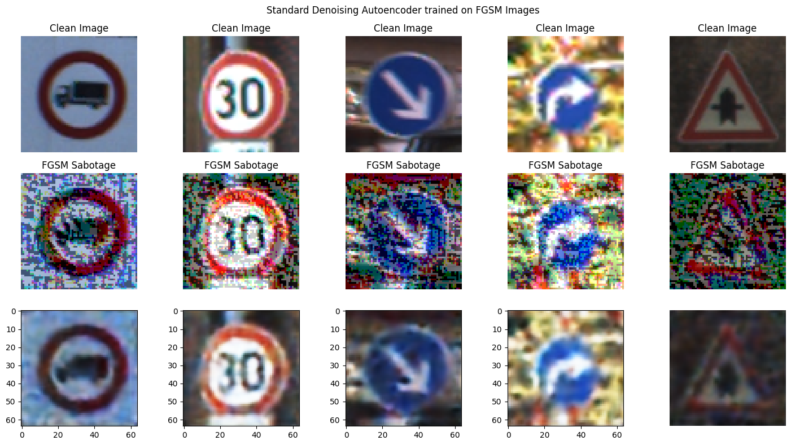
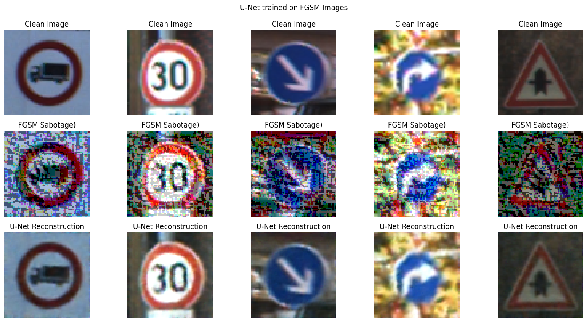
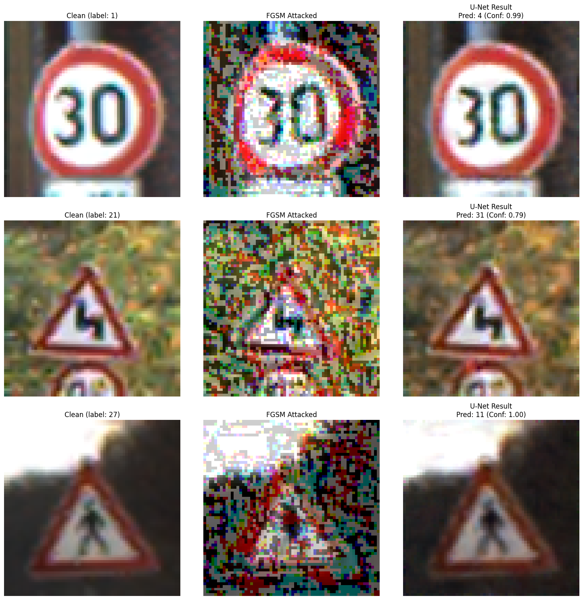

# Defending Against FGSM: A Comparative Analysis of Image Reconstruction Defenses

---

## Introduction

Neural Network based classification models are vulnerable to adversarial attacks, and even imperceptible changes to the human eye can dramatically throw off predictions. 

This tutorial utilizes the German Traffic Sign Recognition Benchmark (GTSRB)[\[2\]](#2) to explore the Fast Gradient Sign Method (FGSM)[\[1\]](#1). We evaluate three different defense mechanisms aimed at removing these adversarial perturbations before they reach the classifier:

1.  **Linear Blur** (Baseline)
2.  **Standard Autoencoder**
3.  **U-Net Autoencoder**

> **Note:** This repository contains a fully runnable Jupyter Notebook designed for **Google Colab** (L4 GPU instance recommended). There are no prerequisites to run the code; it is fully self-contained.

## Related Work & Motivation

Performing image reconstruction via autoencoder architectures as a filter for adversarial noise is a well established area of research. This project builds upon two prominent defensive philosophies.
     
     
- Denoising Autoencoders [\[4\]](#4): Research such as MagNet proposed the use of autoencoders to defend against adversarial examples. MagNet operates on the principle that adversarial perturbations push images away from the manifold of natural data. A first step is trained to determine whether the model has significant perturbations and a second model is used to predict an approximiation of the unperturbed data. This guides our DAE model in this project.

- U-Net Architecture [\[3\]](#3): More complex architectures, such as DUNET, boast higher performance, by moving to a U-Net architecture. While usually used in biomedical image segmentation, they instead used it to predict the noise in an adversarial image, and remove it.

---

## Project Objectives

This project quantitatively evaluates architectural defenses against adversarial attacks. The following objectives were achieved in the attached notebook:

* Implement an **FGSM** attack generator to fool a target classifier (A CNN in this case).
* Develop three distinct image preprocessing defenses.
* Evaluate the robustness of each defense using the following quantitative metrics:
    * **Accuracy**
    * **F1 Score (Macro)**
    * **Recall**
    * **Precision**
    * **Recovery Rate**(described in the [Quantitative Performance](#quantitative-performance) section)
    * **Degradation Rate** (described in the [Quantitative Performance](#quantitative-performance) section)
 * More broadly, the saddle-point (min-max) problem in the literature is used to view the problem (described in the #Quantitative Performance section_

---

## Prerequisites & Colab Setup

This notebook is designed to be plug-and-play on Google Colab.

### 1. Environment Setup
1.  Open the `Computer_Vision_Project.ipynb` in Google Colab.
2.  Go to **Runtime** -> **Change runtime type**.
3.  Select **GPU** as the hardware accelerator (an L4 GPU was used for development and is highly recommended for training the Autoencoders).

### 2. Kaggle Dataset Download
The notebook automatically downloads the required **GTSRB - German Traffic Sign Recognition Benchmark** dataset directly from Kaggle using the `kagglehub` library. No manual API setup or credentials are required.

```python
# Snippet from the notebook: Kaggle Setup
import kagglehub

# Download GTSRB database from kaggle
DATA_PATH = kagglehub.dataset_download("meowmeowmeowmeowmeow/gtsrb-german-traffic-sign")
print("Path to dataset files:", DATA_PATH)
```

---

## Methodology

### 1. The Attack: Fast Gradient Sign Method (FGSM)
FGSM works by utilizing the gradients of the neural network to create an adversarial image. For an input image, the method uses the gradients of the loss with respect to the input image to create a new image that maximizes the loss. [[Ref]](https://www.tensorflow.org/tutorials/generative/adversarial_fgsm)

$$x_{adv} = x + \epsilon \cdot \text{sign}(\nabla_x J(\theta, x, y))$$

Where $\epsilon$ controls the strength of the perturbation (image noise).

### 2. The Defenses
Instead of retraining the classifier, this project uses input reconstruction to "clean" the adversarial images before they reach the classifier.

#### Defense A: Linear Blur (Baseline)
A simple Gaussian blur applied to the images using OpenCV. The hypothesis is that high-frequency adversarial noise might be smoothed out, though at the cost of losing legitimate high-frequency edge features. This is used as a baseline to compare against NN based defenses.

#### Defense B: Standard Autoencoder
A convolutional autoencoder containing an encoder (to compress the image into a latent space) and a decoder (to reconstruct the image). It is trained on clean images, teaching it to project noisy/adversarial images back to a clean state.

#### Defense C: U-Net Autoencoder
An autoencoder featuring skip connections between the encoding and decoding layers. These connections help preserve high-resolution details that a standard bottleneck autoencoder might lose, theoretically providing a much cleaner reconstruction. This is especially important given the nature of an FGSM attack, which exploits subtle perturbations to induce a misclassification. Since these attacks often hide in the fine textures of the image, the skip connections provide an anchor that prevents the autoencoder from inadvertently discarding the aspects of the image that aid in classification while attempting to filter out the sabotage. The U-Net also attempts to only predict the noise in the image and subtract it instead of attempting to predict the entire clean image.

---

## Results & Evaluation

To assess the performance of our defense methods, we employ a suite of standard classification metrics alongside a custom recovery calculation. 

* **Accuracy:** The ratio of correctly predicted traffic signs to the total number of test samples. 
    $$\text{Accuracy} = \frac{TP + TN}{TP + TN + FP + FN}$$
* **Precision (Macro):** Measures the model's reliability by calculating the average ratio of true positive predictions to the total number of positive predictions across all 43 classes. This prevents common signs (like 'Speed Limit 30') from overshadowing rare, critical signs.
    $$\text{Precision} = \frac{1}{N} \sum_{i=1}^{N} \frac{TP_i}{TP_i + FP_i}$$
* **Recall (Macro):** Measures the model's sensitivity by calculating the average ratio of true positives to the total number of actual instances for each class. 
    $$\text{Recall} = \frac{1}{N} \sum_{i=1}^{N} \frac{TP_i}{TP_i + FN_i}$$
* **F1-Score (Macro):** The harmonic mean of Precision and Recall. This is our primary metric as it weights the disparate class evenly.
    $$\text{F1} = \frac{1}{N} \sum_{i=1}^{N} 2 \cdot \frac{\text{Precision}_i \cdot \text{Recall}_i}{\text{Precision}_i + \text{Recall}_i}$$
* **Recovery Rate (%):** A metric designed to quantify the effectiveness of a defense relative to the impact of the attack. It represents the percentage of the F1 score lost to sabotage that was successfully restored by the autoencoder.
    $$\text{Recovery Rate} = \frac{F1_{\text{defense}} - F1_{\text{attack}}}{F1_{\text{clean}} - F1_{\text{attack}}} \times 100$$
* **Degradation rate**  Identifies the percentage of images that were correctly classified in their raw state but became misclassified after processing.
  $$\text{Degradation Rate} = \left( 1 - \frac{|C \cap D|}{|C|} \right) \times 100\%$$
  - ∣C∣: The set of images correctly classified in the baseline state.
  - ∣C∩D∣: The subset of those images that remain correct after the defense is applied.

       
---

### Quantitative Performance
We evaluate defense success through the lens of a saddle-point (min-max) problem, a framework established by Madry et al. (2018)[\[5\]](#5) to analyze adversarial robustness. This model centers around an attack and defense which push and pull a model's loss in different directions. All tests were performed by applying the associated defense method and the performing a prediction using the output with the CNN classifier previously trained on GTSRB data.

Key terms:

- Empirical Risk (Clean): The baseline performance of our classifier on standard, unperturbed data.
- Inner Maximizer (The Attack): Represented here by FGSM, which seeks the perturbation that maximizes classification loss. This represents our Adversarial Risk.
- Outer Minimizer (The Defense): Our reconstruction models (Blur, AE, U-Net) that aim to minimize that loss by cleaning the image before it reaches the classifier.
- Risk Mitigation (%) metric quantifies what percentage of the F1 score lost to the Inner Maximizer was successfully recovered by our Outer Minimizer.

#### Assessing Adversarial Risk (Inner Maximizer)
| Risk Category           |   Sabotage (epsilon) |   Accuracy |   F1 (Macro) |
|-------------------------|----------------------|------------|--------------|
| Empirical Risk (Clean)  |                0.000 |      0.953 |        0.929 |
| Random Noise Baseline   |                0.020 |      0.950 |        0.926 |
| Adversarial Risk (FGSM) |                0.020 |      0.519 |        0.480 |

#### Comparative Analysis of Risk Mitigation (Outer Minimizer)
|   Sabotage (epsilon) |   Accuracy |   F1 (Macro) |   Precision |   Recall | Defense Strategy             | Recovery Rate (%)   |
|----------------------|------------|--------------|-------------|----------|------------------------------|-----------------------|
|                0.020 |      0.519 |        0.480 |       0.507 |    0.482 | No Defense                   | 0.0%                  |
|                0.020 |      0.546 |        0.510 |       0.538 |    0.515 | Linear Blur                  | 6.7%                  |
|                0.020 |      0.640 |        0.600 |       0.620 |    0.604 | Standard AE                  | 26.8%                 |
|                0.020 |      0.845 |        0.805 |       0.823 |    0.803 | Adversarial U-Net (Proposed) | 72.5%                 |


#### F1 Vs Epsilon


The models were also stress tested against epsilon values to determine points of failure.

Overall the FGSM U-Net overperforms every other defense. The model struggles, however, at low espilon values (0.01 and 0.025). It's theorized this may be due to the distribution of low epsilon values in its training, which was 25% of the data being used, whereas 45% of the perturbed data used in training had an epislon between 0.25 and 2. The model likely is over-predicting noise in the image, leading to prediction degradation.

#### Degradation Rate

While defense is great, it may not be free. In real world systems, we need to ensure a low false positive rate to ensure we're not inadvertantly making the model make bad predictions, when it otherwise wouldn't have.

We can observed the degradation rate of each model below:


| Defense Strategy   |  Degradation Rate   |
|--------------------|--------------------------|
| Linear Blur        | 43.32%                   |
| Standard AE        | 1.98%                    |
| Adversarial U-Net  | 0.03%                    |

As the models get better in accordance with our previous analysis, the degradation rate almost vanishes, and our cleaning tax becomes increasingly cheap, dropping to a low of 0.03 with our best model (the Adversarial U-Net)


### Qualitative Performance
Below is a visual comparison of an original image, the FGSM perturbed image (epsilon = 0.1), and the reconstructed outputs from our three defenses.

#### Linear Blur


The Linear/Gaussian Blur we use as our baseline defense performs very poorly as expected. The image definitely gets slightly more discernable, but it's very easy to see why a small prediction model may have issues with prediction. The blur does what it's meant to do and smooths out the image.

#### Denoising Autoencoder Trained on FGSM


The Denoising autoencoder performs much better. The images outputted are discernible, but may have some finer details removed. We can see in the images, the head of the truck and the person on the last image have become more amorphous. Interestingly, the arrows and numbers are preserved fairly well, but they're also preserved fairly well in the noised image, which would explain this. This may be an artifact of the model attempting to predict the entire de-noised image vs our noise prediction approach on the U-Net.

#### U-Net Trained on FGSM


The U-Net so far appears the best. Where the standard DAE failed, the U-Net was able to preserve the finer details of the truck and the person in the first and last image, while retaining all of the strengths of the DAE for the middle images. This can likely be attributed to the lower amount of work the U-Net is doing when it only subtracts the noise, instead of predicting what the clean image looks like.

### Analyzing Failure States

Below are the failed predictions based on output from the U-Net.



Looking at these images, it seems it would be very easy for a human to discern the same categorization based on the output of the U-Net. It does appear the U-Net did a fairly good job of attack mitigation, the issue more likely lies in the capabilities of the classifier. A larger classification model, or a classification model fine tuned on the results of the U-Net may have yielded better results. Additional fine tuning of the U-Net does not appear necessary based on these images.

---

## 💡 Conclusion

* **Linear Blur** proved to be an inadequate defense, often dropping the baseline accuracy on clean images without significantly de-noising the FGSM attack.
* **The Standard Autoencoder** successfully removed some adversarial noise but suffered from detail loss, performed middle of the pack.
* **The U-Net Autoencoder** provided the best trade-off. By utilizing skip connections, it successfully removed the FGSM perturbations while preserving the integrity of the original images, resulting in the highest defense success rate. The images looked the cleanest.

## Future Work

Future work
- Evaluate defenses against iterative attacks like PGD or adaptive adversaries that specifically target the U-Net's skip connections to induce reconstruction artifacts.
- Attempt different training structures to ensure that model performance doesn't drop off at low epsilon values.
- Perform additional fine tuning on the classifier model based on the output of the U-Net.

## References

<a name="1"></a>
**[1]** Goodfellow, I. J., Shlens, J., & Szegedy, C. (2014). **Explaining and Harnessing Adversarial Examples.** *arXiv*. [https://doi.org/10.48550/arxiv.1412.6572](https://doi.org/10.48550/arxiv.1412.6572)

<a name="2"></a>
**[2]** Stallkamp, J., Schlipsing, M., Salmen, J., & Igel, C. (2011). **The German Traffic Sign Recognition Benchmark: A multi-class classification competition.** *IJCNN*. [https://doi.org/10.1109/IJCNN.2011.6033395](https://doi.org/10.1109/IJCNN.2011.6033395)

<a name="3"></a>
**[3]** Liao, F., Liang, M., Dong, Y., Pang, T., Hu, X., & Zhu, J. (2018). **Defense against Adversarial Attacks Using High-Level Representation Guided Denoiser.** *CVPR*.

<a name="4"></a>
**[4]** Meng, D., & Chen, M. (2017). **MagNet: a Two-Pronged Defense against Adversarial Examples.** *ACM CCS*. [https://doi.org/10.48550/arxiv.1705.09064](https://doi.org/10.48550/arxiv.1705.09064)

<a name="5"></a>
**[5]** Madry, A., Makelov, A., Schmidt, L., Tsipras, D., & Vladu, A. (2018). **Towards Deep Learning Models Resistant to Adversarial Attacks.** *ICLR*. [https://doi.org/10.48550/arxiv.1706.06083](https://doi.org/10.48550/arxiv.1706.06083)
